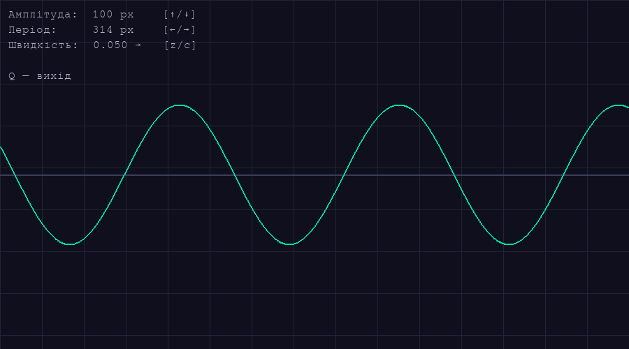

# Sinusoide en movimiento

Una aplicación gráfica que muestra una onda sinusoidal animada.



## Ejecución

```bash
pip install pygame
python3 sinus_game.py
```

## Controles

| Tecla | Acción |
|-------|--------|
| `↑` / `↓` | Aumentar / disminuir la amplitud |
| `←` / `→` | Estrechar / ampliar (cambiar la frecuencia) |
| `c` | Acelerar |
| `z` | Reducir velocidad (si se pulsa varias veces, la onda se mueve en sentido contrario) |
| `q` | Salir |

## Requisitos

- Python 3
- pygame 2.x
